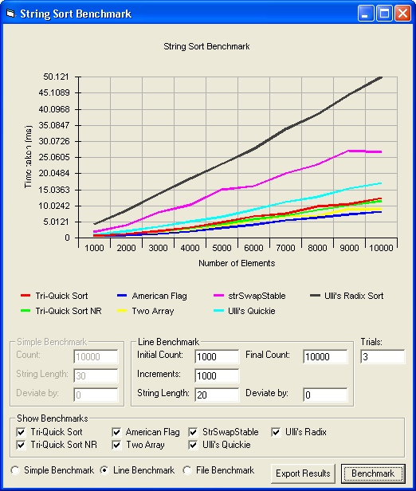



## Super Fast String Sorts Update\(30/03/2007\)

### Description

I have implemented two of the algorithms 'popular' MSD Radix Sorts

based on the implementations done by Peter M. McIlroy and Keith Bostic in

their paper Engineering Radix Sort. Of the techniques used were VBSpeed techniques

such as safearray 'hacking' and others.

These algorithms go extremely fast, about 10x faster than a standard iterative version of

a QuickSort algorithm. This is shown the the accompanying benchmark...

Please compile to native with all advanced options checked to get best results, but I think it performs pretty well in IDE as well.

Updated with TriQuickSort instead of QuickSort.

Updated with TriQuickSort fixed+2x faster

Updated with TriQuickSort Non-Recursive, rd's strSwapTable, Export to CSV

Updated with some GUI changes and Ulli's algos
 
### More Info
 
Unsorted String Arrays

Sorted String Arrays

             |
---                |---
**Submitted On**   |2007-03-30 09:31:00
**By**             |[Tai Chi Minh Ralph Eastwood](https://github.com/Planet-Source-Code/PSCIndex/blob/master/ByAuthor/tai-chi-minh-ralph-eastwood.md)
**Level**          |Intermediate
**User Rating**    |4.9 (93 globes from 19 users)
**Compatibility**  |VB 5\.0, VB 6\.0
**Category**       |[VB function enhancement](https://github.com/Planet-Source-Code/PSCIndex/blob/master/ByCategory/vb-function-enhancement__1-25.md)
**World**          |[Visual Basic](https://github.com/Planet-Source-Code/PSCIndex/blob/master/ByWorld/visual-basic.md)
**Archive File**   |[Super\_Fast2057323302007\.zip](https://github.com/Planet-Source-Code/tai-chi-minh-ralph-eastwood-super-fast-string-sorts-update-30-03-2007__1-67522/archive/master.zip)

